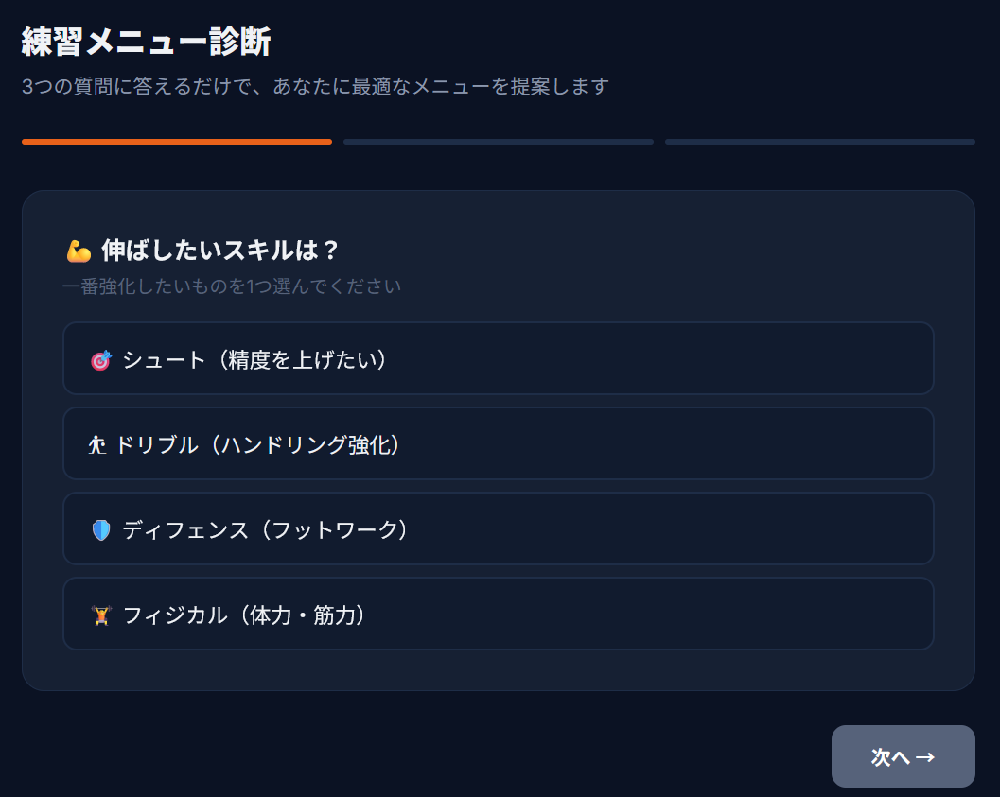
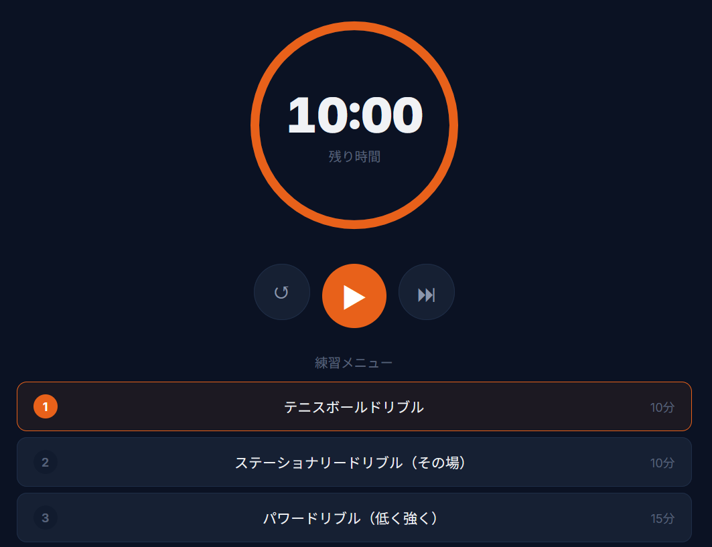

# 🏀 6th Man

控え選手向けの自主練習支援Webアプリ

🔗 **Demo**：https://hayashi-12.github.io/6th_Man-html/

🔗 **GitHub**：https://github.com/Hayashi-12/6th_Man-html

## 📸 アプリ画面

### ホーム画面

### 練習メニュー診断

### 練習タイマー

---

## 🏀 概要

「6th Man」は、バスケットボールの控え選手が体育館に着いた瞬間に迷わず自主練習を始められることを目指したWebアプリです。
伸ばしたいスキル・使える時間・練習環境の3つの質問から最適な練習メニューを提案し、タイマー・練習記録・スキル可視化で継続的な成長をサポートします。

---

## 🎯 開発の背景

高校時代、バスケットボール部で控え選手として活動していました。
レギュラーにはコーチがメニューを組んでくれますが、控えの自主練習は自分で考えるしかありません。「何をどのくらいやればいいか分からない」という状態が続き、練習の質ではなく迷う時間で伸び悩んでいました。

そこで自分なりに練習方法を調べて試行錯誤を重ね、自主練習を継続した結果、レギュラーとして試合に出場できるようになりました。

この経験から、過去の自分と同じように自主練習に悩む選手を支援したいと考え、本アプリを開発しました。

---

## ✨ 主な機能

### 練習メニュー診断
伸ばしたいスキル・練習時間・利用可能な設備の3つの質問から、条件に合った自主練習メニューを自動で組み立てます。メニューは毎回シャッフルされるため、同じ回答でも異なる提案が出ます。

### 練習タイマー
提案されたメニューに連動するカウントダウンタイマー。SVGによる円形プログレスバーで残り時間を視覚的に表示し、メニュー完了時に自動で次の練習へ進みます。

### 成長カレンダー
練習した日をカレンダー上に記録し、累計練習日数・連続記録・今月の練習回数を自動集計します。タイマー完了時には自動で記録がつくため、記録忘れを防ぎます。

### スキル評価
シュート・ドリブル・ディフェンス・フィジカル・パス・判断力の6項目を自己評価し、レーダーチャートで可視化。過去の評価を保存でき、前回との比較が一目で分かります。

---

## 🛠 使用技術

| 技術 | 用途 |
|---|---|
| HTML / CSS / JavaScript | アプリ全体の構造・デザイン・ロジック |
| CSS Grid | カレンダーの7列レイアウト |
| CSS Custom Properties | アプリ全体のカラーテーマ一括管理 |
| SVG | 円形タイマーのプログレスバー（stroke-dashoffset制御） |
| Chart.js | スキル評価のレーダーチャート描画 |
| LocalStorage | 練習記録・スキル評価のデータ永続化（JSON形式） |
| レスポンシブデザイン | スマホでの体育館利用を想定したUI対応 |
| PWA（Service Worker） | オフライン動作・ホーム画面へのインストール対応 |

---

## 💡 工夫した点

### 器具条件に応じたフィルタリング
練習メニューごとに必要な器具（ボールのみ / ゴール有り / フル装備）を定義し、ユーザーの練習環境に合うメニューだけを抽出する設計にしました。公園でも体育館でも使えるアプリを目指しました。

### SVGによる円形タイマー
`stroke-dasharray`と`stroke-dashoffset`を使い、円周上の塗りを制御してカウントダウンを表現しています。残り10秒で警告色に切り替わることで、時間を直感的に把握できるUIにしました。

### 機能間の自動連携
タイマーで全メニューを完了すると、成長カレンダーに自動で練習記録がつく仕組みにしました。「記録をつけ忘れる」という離脱要因をなくし、継続を支援する設計です。

### 1ファイル完結の構成
HTML/CSS/JavaScriptをすべて`index.html`に集約し、ビルドツールやサーバーなしでブラウザだけで動作します。全関数に日本語コメントで処理内容を記載し、可読性を重視しました。

---

## 🚀 今後の改善

- **Firebase連携によるデータ保存** — 現在のLocalStorageではブラウザ間でデータが共有できないため、Firebaseを導入してユーザーごとのデータ管理を実現したい
- **Reactを用いたコンポーネント分割** — 現在の1ファイル構成をReactで再構築し、コードの保守性と再利用性を向上させたい